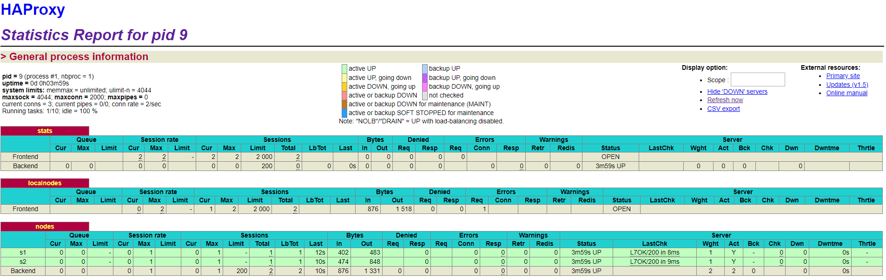

# AIT Lab 04 - Docker

Authors: Mathieu Jee, Loïc Schürch

Date: January 2019

## Table of Contents

[TOC]

## Introduction

For this lab, we will use the simple distributed system with a load-balancer and webapps from the previous lab. The goal is to configure our system to be able to take action automatically when we add or remove webapps.

We will have to setup a process supervisor for our Docker containers. By default, Docker accepts only one process per container. We will use a process suervisor called `S6` to bypass this constraint. Then, we will install a tool to manage membership in the web server cluster. This tool, called `Serf`, will offer the possibility to react to membership changes using a template engine to genereate new configuration files for the load-balancer.

At the end of this lab, our load-balancer will be able to automatically modify its configuration when we add or remove a webapp.


## Task 0: Identify issues and install the tools

- **[M1]: Do you think we can use the current solution for a production environment ? What are the main problems when deploying it in a production environment ?**

  The current solution is not practical for a production environment. In case of a webapp crash, we have to stop and restart the container manually. Plus, the load-balancer won't be notified of this crash and will keep redirect requests to the webapp who crashed. It means that there must always be a person in charge of monitoring the system and act if there are failures.


- **[M2]: Describe what you need to do to add new `webapp` container to the infrastructure. Give the exact steps of what you have to do without modifiying the way the things are done. Hint: You probably have to modify some configuration and script files in a Docker image.** 

  With this current infrastructure, all webapp are hardcoded. The system is not dynamic at all. We have to modify the Docker image of the load-balancer to add new webapp. 

  First, we have to add this following line in `/vagrand/ha/scripts/run.sh` script:

  ```bash
  sed -i 's/<s3>/$S3_PORT_3000_TCP_ADDR/g' /usr/local/etc/haproxy/haproxy.cfg
  ```

  Don't forget to add the env variable `$S3_PORT_3000_TCP_ADDR` inside `/usr/local/etc/haproxy/haproxy.cfg`.

  Then, add this line at the end (line 113) of the config file `/vagrant/ha/config/haproxy.cfg`: 

  ```
  server s3 <s3>:3000 check
  ```


- **[M3]: Based on your previous answers, you have detected some issues in the current solution. Now propose a better approach at a high level.**

  A better approach at a high level would be to automate some tasks like starting or shutting down webapps. For now, we have to execute these commands manually. The goal here for the system would be add or remove webapps on its own according to the traffic intensity.


- **[M4]: You probably noticed that the list of web application nodes is hardcoded in the load balancer configuration. How can we manage the web app nodes in a more dynamic fashion ?**

  The load-balancer should be capable to identify new nodes and be notified for any failures. To manage webapp node in a more dynamic fashion, we will setup a cluster with a tool of membership management (*see task 2*).


- **[M5]: In the physical or virtual machines of a typical infrastructure we tend to have not only one main process (like the web server or the load balancer) running, but a few additional processes on the side to perform management tasks.**

  **For example to monitor the distributed system as a whole it is common to collect in one centralized place all the logs produced by the different machines. Therefore we need a process running on each machine that will forward the logs to the central place. (We could also imagine a central tool that reaches out to each machine to gather the logs. That's a push vs. pull problem.) It is quite common to see a push mechanism used for this kind of task.**

  **Do you think our current solution is able to run additional management processes beside the main web server / load balancer process in a container? If no, what is missing / required to reach the goal? If yes, how to proceed to run for example a log forwarding process ?**

  Our current solution is not able to run additional management processes beside the main process in a container. This is because of the Docker philosophy: `One process per container`. If we want to bypass this philosophy, we have to install a process supervisor. This supervisor will allow our container to run multiple process at the same time. Basically, a docker container is killed if its process stops. The process supervisor will therefore always be running to avoid the death of the container and will start process in its own layer.

  

- **[M6]: In our current solution, although the load balancer configuration is changing dynamically, it doesn't follow dynamically the configuration of our distributed system when web servers are added or removed. If we take a closer look at the `run.sh` script, we see two calls to `sed` which will replace two lines in the `haproxy.cfg` configuration file just before we start `haproxy`. You clearly see that the configuration file has two lines and the script will replace these two lines.**

  **What happens if we add more web server nodes? Do you think it is really dynamic? It's far away from being a dynamic configuration. Can you propose a solution to solve this?**

  With this current configuration, the system is not dynamic. To be dynamic, the system should adapt every time there is a modification in the cluster. With a proper tool to manage membership in our webapp cluster, we can notify the load-balancer of any changes and modify its configuration files with scripts.


Stats: 




URL of our repository: https://github.com/mathieujee/Teaching-HEIGVD-AIT-2016-Labo-Docker


## Task 1: Add a process supervisor to run several processes

Stats:


No particular difficulties encountered for this task. The main goal of this task was to configure our docker images to setup a process supervisor. The process supervisor (also called "*init system*") gives us the possibility to have multiple process on each container and, therefore, breaks the "one process per container" Docker philosophy.

For this lab, we use `S6-overlay` as process supervisor. With S6, we can also choose which process can restart, and wich process should exit the container. 


## Task 2: Add a tool to manage membership in the web server cluster

**1. Provide the docker log output for each of the containers: `ha`, `s1` and `s2`. You need to create a folder `logs` in your repository to store the files separately from the lab report. For each lab task create a folder and name it using the task number. No need to create a folder when there are no logs.**

See:

```
logs/task2/HA_logs.txt
logs/task2/S1_logs.txt
logs/task2/S2_logs.txt
```

**2. Give the answer to the question about the existing problem with the current solution.**

In our current solution, there is kind of misconception around the way we create the `Serf` cluster. The probleme is that if we run the webapps container first, it will fail because the `Serf` agent of `ha` is not available (webapps nodes will try to connect to the `Serf` cluster via `ha` container). If we start `ha` container first, it will fail because it will try to link the webapps container (that are not started yet). On the other hand, with this second approach, we can run webapps container successfully. 

To solve this issue, we have to modify the `Serf` command by replacing `--join` by `--retry-join`. 

- `-retry-join`: Address of another agent to join after starting up. This can be specified multiple times to specify multiple agents to join. If Serf is unable to join with any of the specified addresses, the agent will retry the join every `-retry-interval` up to `-retry-max` attempts. This can be used instead of `-join` to continue attempting to join the cluster. 

- `-retry-interval`:  Provides a duration string to control how often the retry join is performed. By default, the join is attempted every 30 seconds until success. This should use the "s" suffix for second, "m" for minute, or "h" for hour.
- `-retry-max`: Provides a limit on how many attempts to join the cluster can be made by `-retry-join`. If 0, there is no limit, and the agent will retry forever. Defaults to 0.

*Source:* https://www.serf.io/docs/agent/options.html

**3. Give an explanation on how `Serf` is working. Read the official website to get more details about the `GOSSIP` protocol used in `Serf`. Try to find other solutions that can be used to solve similar situations where we need some auto-discovery mechanism.**

`Serf` is a tool for cluster membership, failure detection, and orchestration that is decentralized, fault-tolerant and highly available.`Serf` relies on a lightweight protocol to communicate with every nodes of the cluster. Each `Serf Agent` send periodically messages to others `Serf Agents` to notify them of its status. Therefore, `Serf` is very useful and efficient to detect any failure inside nodes. It can also run custom scripts when custom events appear. These scripts can, for example, deploy or restart processes. 

The `GOSSIP` protocol used in `Serf` broadcasts messages to the cluster. Communication are done over UDP.  `GOSSIP` brings solutions to three major problems:

- Membership: `Serf` maintains cluster membership lists and is able to run custom scripts when a new node appears or an old one leaves. In our lab, `Serf` can maintain a list with our webapps for our load-balancer and notify it when a node comes online or goes offline.

- Failure detection and recovery: `Serf` automatically detects failed nodes within seconds, notify the whole cluster and can run custom scripts to handle these events. `Serf` will also try to reconnect to these nodes periodically.

- Custom event propagation: `Serf` can broadcast custom events and queries to the cluster to trigger deploys, propagate configuration, ... 

  

Other solutions that can be used to auto-discover nodes in cluster:

- Apache Ignite: offers two discovery mecasisms:
  - TCP/IP Discovery (designed and optimized for 100s of nodes deployments)
  - ZooKeeper Discovery (allows scaling Ignite clusters to 100s and 1000s of nodes preserving linear scalability and performance)


## Task 3: React to membership changes

**1. Provide the docker log output for each of the containers: `ha`, `s1` and `s2`. Put your logs in the `logs` directory you created in the previous task.**

See:

```
logs/task3/HA_logs_1.txt
logs/task3/HA_logs_2 (after running s1 only).txt
logs/task3/HA_logs_3 (after runing s1 and s2).txt
logs/task3/S1_logs.txt
logs/task3/S2_logs.txt
```

**2. Provide the logs from the `ha` container gathered directly from the `/var/log/serf.log` file present in the container. Put the logs in the `logs` directory in your repo.**

See: 

 ```
logs/task3/HA_logs_4 (custom log file).txt
 ```


## Task 4: Use a template engine to easily generate configuration files

**1. You probably noticed when we added `xz-utils`, we have to rebuild the whole image which took some time. What can we do to mitigate that? Take a look at the Docker documentation on [image layers](https://docs.docker.com/engine/userguide/storagedriver/imagesandcontainers/#images-and-layers). Tell us about the pros and cons to merge as much as possible of the command. In other words, compare:**

```
RUN command 1
RUN command 2
RUN command 3
```

vs.

```
RUN command 1 && command 2 && command 3
```

**There are also some articles about techniques to reduce the image size. Try to find them. They are talking about `squashing` or`flattening` images.**

In older version of Docker, it was important to minimize the number of layers to ensure their performance. Each time we use `RUN` command, it creates a new layer. By merging commands, we reduce the number of layers and improve the building speed.

"Squash" or "flatten" Docker images (or container) to make them smaller: 

- https://github.com/jwilder/docker-squash
- https://tuhrig.de/flatten-a-docker-container-or-image/
- https://www.codacy.com/blog/five-ways-to-slim-your-docker-images/


**2. Propose a different approach to architecture our images to be able to reuse as much as possible what we have done. Your proposition should also try to avoid as much as possible repetitions between your images.**


**3. Provide the `/tmp/haproxy.cfg` file generated in the `ha` container after each step. Place the output into the `logs` folder like you already did for the Docker logs in the previous tasks. Three files are expected.**

**In addition, provide a log file containing the output of the `docker ps` console and another file (per container) with `docker inspect <container>`. Four files are expected.**

See: 

```
logs/task4/haproxy.cfg.txt
logs/task4/haproxy.cfg (after running S1).txt
logs/task4/haproxy.cfg (after running S2).txt
```

and:

```
logs/task4/docker_ps.txt
logs/task4/docker_inspect_ha.txt
logs/task4/docker_inspect_S1.txt
logs/task4/docker_inspect_S2.txt
```


**4. Based on the three output files you have collected, what can you say about the way we generate it ? What is the problem if any ?**

The content of the file `haproxy.cfg` is overwritten. It only contains the id and the ip of the last node who joined the cluster. We should append data in the file instead of overwrite it.


## Task 5: Generate a new load balancer configuration when membership changes

**1. Provide the file `/usr/local/etc/haproxy/haproxy.cfg` generated in the `ha` container after each step. Three files are expected.**

See:

```
logs/task5/haproxy.cfg (after running ha).txt
logs/task5/haproxy.cfg (after running s1).txt
logs/task5/haproxy.cfg (after running s2).txt
```

**In addition, provide a log file containing the output of the `docker ps` console and another file (per container) with `docker inspect <container>`. Four files are expected.**

See:

```
logs/task5/docker_ps.txt
logs/task5/docker_inspect_ha.txt
logs/task5/docker_inspect_s1.txt
logs/task5/docker_inspect_s2.txt
```

**2. Provide the list of files from the `/nodes` folder inside the `ha` container. One file expected with the command output.**

See:

```
logs/task5/ls_nodes
```

**3. Provide the configuration file after you stopped one container and the list of nodes present in the `/nodes` folder. One file expected with the command output. Two files are expected.**

See:

```
logs/task5/haproxy.cfg (after stopping s1).txt
logs/task5/ls_nodes (after stopping s1).txt
```

**In addition, provide a log file containing the output of the `docker ps` console. One file expected.**

See: 

```
logs/task5/docker_ps (after stopping s1).txt
```

**4. (Optional:) Propose a different approach to manage the list of backend nodes. You do not need to implement it. You can also propose your own tools or the ones you discovered online. In that case, do not forget to cite your references.**

/

## Task 6: Make the load balancer automatically relaod the new configuration

**1. Take a screenshots of the HAProxy stat page showing more than 2 web applications running. Additional screenshots are welcome to see a sequence of experimentations like shutting down a node and starting more nodes.**

**Also provide the output of `docker ps` in a log file. At least one file is expected. You can provide one output per step of your experimentation according to your screenshots.**


**Initial state** (before running any webapp):


See the `docker ps` output:

```bash
logs/task6/docker_ps_initial_state.txt
```


**HAProxy stat page after starting 4 webapps:**


With its `docker ps` output: 

```
logs/task6/docker_ps_after_starting_webapps.txt
```


**HAProxy stat page after shutting down 2 webapps (s1 and s2):**


With its `docker ps` output:

```
logs/task6/docker_ps_after_stopping_s1_s2.txt
```


**HAProxy stat page after starting a new webapp (s5):**


With its `docker ps` output:

```
logs/task6/docker_ps_after_starting_s5.txt
```


**2. Give your own feelings about the final solution. Propose improvements or ways to do the things differently. If any, provide references to your readings for the improvements.**

With this final solution, we still have to start and stop webapp manually. The system should be able to handle itself automatically. For example, in case of a high traffic like for the Black Friday, the system should be able to start itself as many webapps as needed and shutting them down after when the traffic slows down.


Deployment Strategies for Auto-Scaling and Load Balancing EC2 Instances in AWS:

https://dev.to/ashanfernando/deployment-strategies-for-auto-scaling-and-load-balancing-ec2-instances-in-aws--2e6l


**3. (Optional:) Present a live demo where you add and remove a backend container.**

/


## Difficulties

The main difficulty of this lab was to properly understand each steps and configuration. However, finding documentation about each steps was pretty easy and helped us to have a better understanding of these mecanisms. 


## Conclusion

This lab teached us how to modify a load-balancer configuration to make it dynamic. To achieve this goal, we had to understand (the basics) and install 2 tools: `S6` and `Serf`.

`S6` is a small process supervisor that brought to us the solution to run multiple processes in a Docker container. 

`Serf` was used to manage the cluster of webapps. It offered us a way to notifiy the load-balancer of any changes in members status and react to these events (by running custom scripts).

With this final solution, our system is dynamic and can accept new nodes without any problems. Even if a webapp shuts down or crashes, the load-balancer configuration will automatically adapt. 

The initial goal was to build a system which can add or remove webapp according to the incoming trafic. This goal is partially reached. In fact, we can add or remove any number of webapps as we like, but these actions are still not automated. FIrst, we have to monitor the traffic in the system to run commands to add or remove webapps.

